# 16S_metabarcoding_phyloseq
#Analysis of Mothur Processed Reads in RStudio 
This tutorial was adapted from http://deneflab.github.io/MicrobeMiseq/demos/mothur_2_phyloseq.html

# Introduction
This tutorial is a continuation of the 16S-rRNA-Metabarcoding-analysis using Mothur. 
Sequences were generated using data from a hydrocarbon bioremediation project. Two treatments were selected for this tutorial, bioaugmentation with *Acinetobacter, Pseudomonas* and *Rhodococcus* strains, and a control. 
Both treatments were inoculated with a high concentration of diesel before the beginning of the experiment and were periodically turned over for aeration. Temperature, pH, total petroleum hydrocarbons (TPH) and other physicochemical parameters were monitored. 
The fundamental question of the experiment was to observe the bacterial communities' changes across the experiment, and evaluate how they change while the TPH concentration decreases.

#Download Files
If you already did the "Raw Reads Analysis Tutorial Using Mothur" (https://github.com/AndresICM/16S-rRNA-Metabarcoding-analysis), then you already have two files needed for this tutorial in your "Contis" folder. If so, copy "Contigs/tutorial.an.shared" and "Contigs/tutorial.taxonomy" to your working folder, otherwise download these files from this repository. 
Additionally, there is a file called Map_file.csv. This file is a table with information from each sample. The first column tells us the group that Mothur assigned to each sample, then there is the original name assigned to them; third, the bioremediation strategy of each sample (bioaugmentation or control); fourth, a number assigned to each sample, just to make our lives easier when making graphics. Finally, there is the real time (in weeks) of when the sample was obtained, the Total Petroleum Hydrocarbons (TPH) in ppm, pH and Humidity (%) of each sample.

```
#Sample,Original_name,Treatment,Number,Time,TPH,pH,Humidity
#Group_0,BA3T01,Bioaugmentation,1,0,17830.29863,6.97,8.8
#Group_1,BA3T03,Bioaugmentation,2,2,15965.66405,8.42,7.18
#Group_2,BA3T07,Bioaugmentation,3,6,6851.652868,9.17,6.22
#Group_3,BA3T11,Bioaugmentation,4,10,7646.375894,9.28,10.02
#Group_4,LF3T01,Control,1,0,18478.85447,6.9,5
#Group_5,LF3T03,Control,2,2,19130.27379,6.84,6.64
#Group_6,LF3T07,Control,3,6,13256.93642,6.6,3.64
#Group_7,LF3T11,Control,4,10,9246.770358,6.9,5.13
```
Now we have everything we need to start this tutorial

# Load Libraries
We will need these R packages to process our 16S rRNA metabarcoding data
```
library(ggplot2)
library(vegan)
library(dplyr)
library(scales)
library(grid)
library(reshape2)
library(phyloseq)
library(ggpubr)
```

# Import Files to RStudio

I will set as a working environment a folder called Tutorial

```
setwd("~/Tutorial")
```
Then, we can assign some variables for the files that we will use

```
# Assign variables for imported data
sharedfile = "Contigs/tutorial.an.shared"
taxfile = "Contigs/tutorial.taxonomy"
mapfile = "Map_file.csv"
```
We can now import the map file and the Mothur data as a phyloseq object

```
# Import mothur data
mothur_data <- import_mothur(mothur_shared_file = sharedfile,
                             mothur_constaxonomy_file = taxfile)
                             
# Import sample metadata
map <- read.csv(mapfile)
map <- sample_data(map)
```
Now to merge the map file with Mothur data, we need that the row names from the map file match the sample names in the shared and taxonomy files

```
# Assign row names to be Sample 
rownames(map) <- map$Sample

# Merge mothurdata object with sample metadata
moth_merge <- merge_phyloseq(mothur_data, map)
moth_merge
```
Now we have a phyloseq object called moth_merge. We can take a look at the column names of that file.

```
colnames(tax_table(moth_merge))

#[1] "Rank1" "Rank2" "Rank3" "Rank4" "Rank5" "Rank6"
```
So, we better assign some taxonomic names to that file and inspect how our column names look like then

```
colnames(tax_table(moth_merge)) <- c("Kingdom", "Phylum", "Class", 
                                     "Order", "Family", "Genus")
                                     
colnames(tax_table(moth_merge))

#[1] "Kingdom" "Phylum"  "Class"   "Order"   "Family"  "Genus"
```
Now we will assign a different name to our phyloseq file, and remove mitochondria and chloroplast OTUs from our files, even though we already have done that using Mothur

```
Valp <- moth_merge %>%
  subset_taxa(
    Kingdom == "Bacteria" &
      Family  != "mitochondria" &
      Class   != "Chloroplast"
  )
Valp
```
# Relative Abundance Histograms

## Phylum level
Now we have all set to prepare some figures. First, we want to know the composition of the microbial communities of each sample

First, we can start observing the composition at a phylum level. For that we need to group our OTUs by phylum; transform the OTU abundance to relative abundance; we can filter low abundance taxa, and finally sort data alphabetically.

```
Valp_phylum <- Valp %>%
  tax_glom(taxrank = "Phylum") %>%                     # agglomerate at phylum level
  transform_sample_counts(function(x) {x/sum(x)} ) %>% # Transform to rel. abundance
  psmelt() %>%                                         # Melt to long format
  filter(Abundance > 0.01) %>%                         # Filter out low abundance taxa
  arrange(Phylum)                                      # Sort data frame alphabetically by phylum
```
If we want, we can define a color palette for our histogram (some color palettes can be observed https://nanx.me/ggsci/articles/ggsci.html ) 
Here we defined we want to use the "jco" color palette, and that we want 10 different colors.
```
phylum_colors <- get_palette(palette="jco", 10)
```

Now we can make a histogram. In this code, we are specifying that the X-axis will be the samples, Y-axis the abundance and that it should fill the histograms by phylum.

```
ggplot(Valp_phylum, aes(x = Sample, y = Abundance, fill = Phylum)) +
geom_bar(stat = "identity", position = "fill")
```
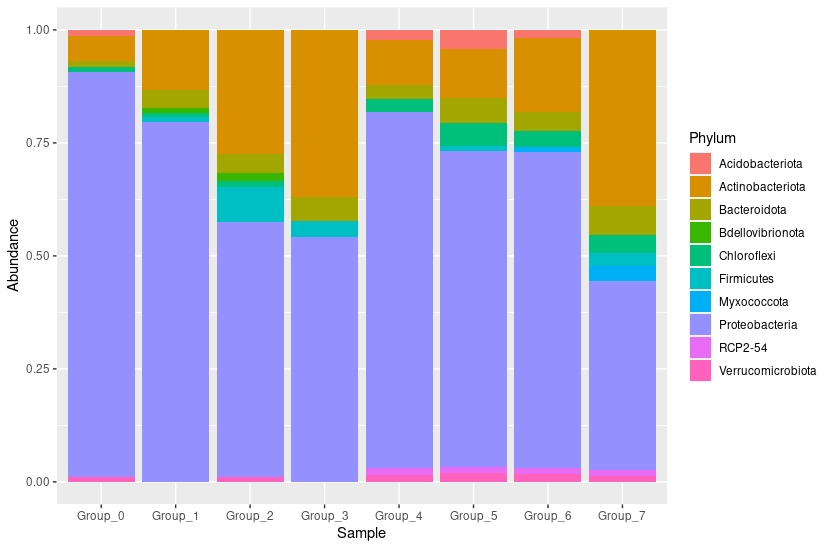

Now we can add the pre-defined color palette

```
ggplot(Valp_phylum, aes(x = Sample, y = Abundance, fill = Phylum)) +
geom_bar(stat = "identity", position = "fill") +
scale_fill_manual(values = phylum_colors) 
```
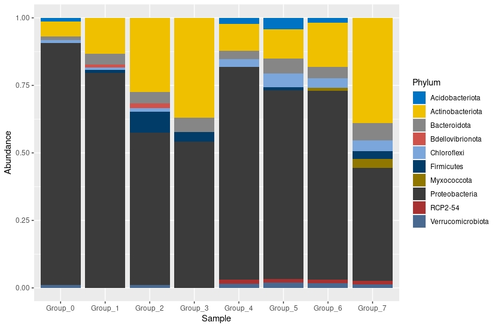

Now, we can separate the histograms by treatments, bioaugmentation and control. For that, we will use facet_wrap. and specify that we want to group the samples by Treatment in two columns. 

```
ggplot(Valp_phylum, aes(x = Sample, y = Abundance, fill = Phylum)) +
geom_bar(stat = "identity", position = "fill") +
scale_fill_manual(values = phylum_colors) +
facet_wrap(~Treatment, ncol=2)
```
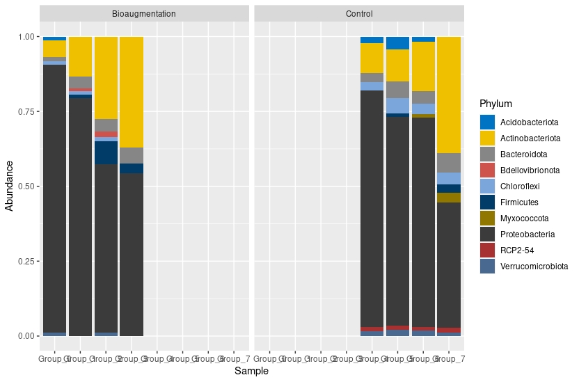

We can now observe that our histograms do not look good. Since each sample has a different name, facet_wrap assumes that bioaugmentation samples have zero abundance in Group_4-Group_7 and for Control from Group_0-Group_3. 
To fix that, we will change the x = Sample line and change it to x = Number. This is a number that I assigned to each sample in the map file, according to the weeks they were obtained. 

```
ggplot(Valp_phylum, aes(x = Number, y = Abundance, fill = Phylum)) +
geom_bar(stat = "identity", position = "fill") +
scale_fill_manual(values = phylum_colors) +
facet_wrap(~Treatment, ncol=2)
```
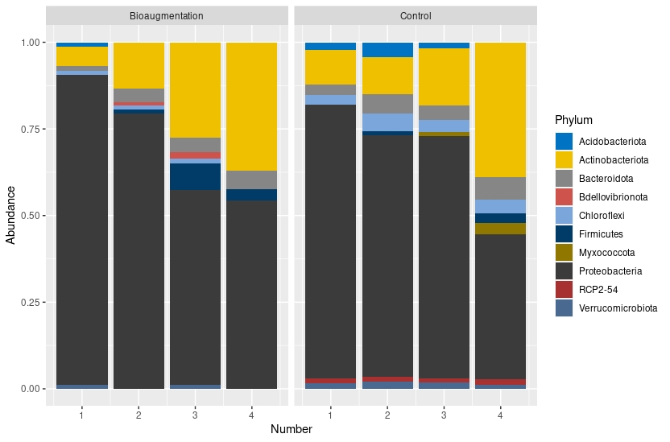

Now it does look better, but we need to make some final arrangements. We can change the X-axis and Y-axis titles set the real time in weeks that the samples were collected and add a title to the histogram.

```
ggplot(Valp_phylum, aes(x = Number, y = Abundance, fill = Phylum)) +
geom_bar(stat = "identity", position = "fill") +
scale_fill_manual(values = phylum_colors) +
facet_wrap(~Treatment, ncol=2) +
scale_x_discrete(
  name="Time (weeks)",
  limits=c("0","2","6","10"))+
ylab("Relative Abundance (Phyla > 1%) \n") +
ggtitle("Phylum Composition") 
```
Now we set the X-axis as Time (weeks), the Y-axis as Relative abundance (Phyla >1%) and a title that specifies that we are observing the Phylum composition. Now we just want to save our figure. 

```
ggsave("Abundance_Phylum.png", device= "png", width = 20,height = 15, units="cm")
```
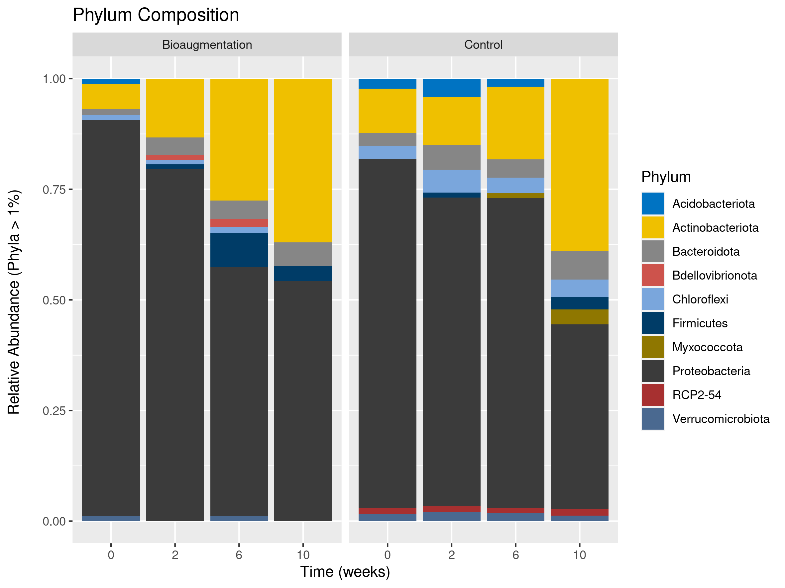

## Genus level

We can make histograms for each taxonomic rank we want, but we are going to skip class, order and family levels and go straight to genus. For that, we will repeat the same steps that we did for the phylum level.

```
Valp_genus <- Valp %>%
  tax_glom(taxrank = "Genus") %>%                     # agglomerate at class level
  transform_sample_counts(function(x) {x/sum(x)} ) %>% # Transform to rel. abundance
  psmelt() %>%                                         # Melt to long format
  filter(Abundance > 0.01) %>%                         # Filter out low abundance taxa
  arrange(Genus)                                      # Sort data frame alphabetically by phylum
```
We can define a color palette. This time we will use the "aaas" color palette

```
genus_colors <- get_palette(palette="aaas", 10)
```
And we can now plot
```
ggplot(Valp_genus, aes(x = Number, y = Abundance, fill = Genus)) +
  geom_bar(stat = "identity", position = "fill") +
  scale_fill_manual(values = genus_colors) +
  facet_wrap(~Treatment, ncol=2) +
  scale_x_discrete(
    name="Time (weeks)",
    limits=c("0","2","6","10"))+
  ylab("Relative Abundance (Genus > 1%) \n") +
  ggtitle("Genus Composition") 
    
```
```
Error: Insufficient values in manual scale. 49 needed but only 10 provided.
```
So, we have an error because we defined only 10 colors in the palette, and we needed 49. So we have to define again our color palette

```
genus_colors <- get_palette(palette="aaas", 49)

ggplot(Valp_genus, aes(x = Number, y = Abundance, fill = Genus)) +
  geom_bar(stat = "identity", position = "fill") +
  scale_fill_manual(values = genus_colors) +
  facet_wrap(~Treatment, ncol=2) +
  scale_x_discrete(
    name="Time (weeks)",
    limits=c("0","2","6","10"))+
  ylab("Relative Abundance (Genus > 1%) \n") +
  ggtitle("Genus Composition") 
```
```
ggsave("Abundance_Genus.png", device= "png", width = 50,height = 20, units="cm")

```
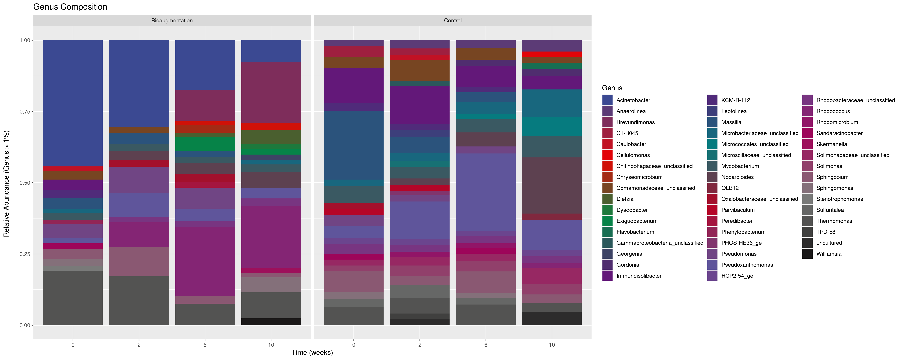

## Alpha diversity

First, we are going to rarefy all samples to an even depth.

```
min_lib <- min(sample_sums(Valp))
Valp_r <- rarefy_even_depth(Valp, sample.size = min_lib, verbose = FALSE, replace = TRUE)
```

Then, we can graph de diversity with plot_richness. This will create graphics with several alpha diversity indicators (Observed, Chao, ACE, Shannon, Simpson, InvSimpson and Fisher)

```
p <- plot_richness(Valp_r, "Number","Treatment") 
```
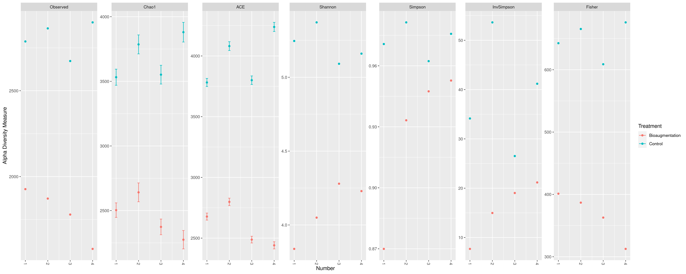

We created a plot where the X-axis is the number of each sample, and is colored by treatment. Now we can correct the Y-axis name and save it.

```
 p + scale_x_discrete(
      name="Time (weeks)",
      limits=c("0","2","6","10")) 

ggsave("Diversity_rarefied_v2.png", device= "png", width = 50,height = 20, units="cm")
```
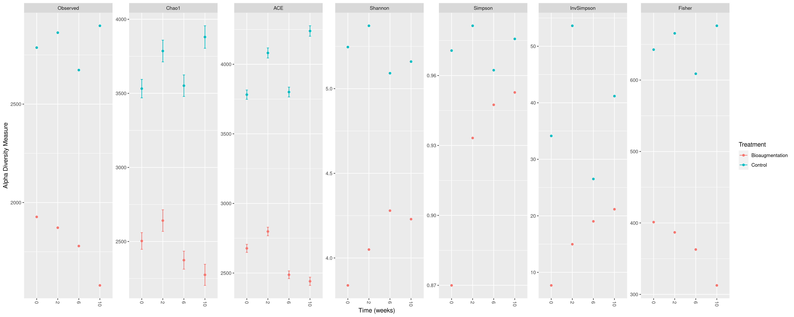


## Rarefaction Curves

To create rarefaction curves, first, we need to read the rarefaction file created from Mothur

```
rarefaction <- read.table("tutorial.an.groups.rarefaction", header=TRUE)
rarefaction
```
This file needs some editing, so we are going to take only the columns with "unique" on them, and change the column names to match the names of the samples.

```
#Take only the columns with "unique" on them
rarefaction_columns <- rarefaction[grepl("unique", names(rarefaction))]

#Change column names
colnames(rarefaction_columns) <- map$Original_name
```
Now we have a file with the right column names and the OTUs abundance observed in each sample. However, we are missing the information on the number of reads. Therefore, we are going to take that information from the original file and merge it with our rarefaction_columns file

```
#take numsampled column
numSampled <- rarefaction[,c("numsampled")]

#Combine numsampled with 
rarefaction_data <- cbind(numSampled,rarefaction_columns)
```
Before plotting, we need to transform this data into long format

```
#transform data to long form
long_rarefaction_data <- melt(rarefaction_data, id.vars="numSampled")
```
Now we can make the rarefaction curves. We are using as X-axis the number of reads and the Y-axis the number of observed OTUs.

```
ggplot(data=long_rarefaction_data,
  aes(x=numSampled, y=value, color=variable))+
  geom_line()+
  ggtitle("Rarefaction curve")+
  labs(x="Sample size", y="Number of OTUs")+
  guides(color=guide_legend("Samples", ncol=1))+
  theme_bw() + theme(panel.border=element_blank(), panel.grid.major = element_blank(), plot.title= element_text(hjust=0.5),
                     panel.grid.minor = element_blank(), axis.line = element_line(colour="black"))

ggsave("Rarefaction_curve.png", device= "png", width = 40,height = 20, units="cm")
```
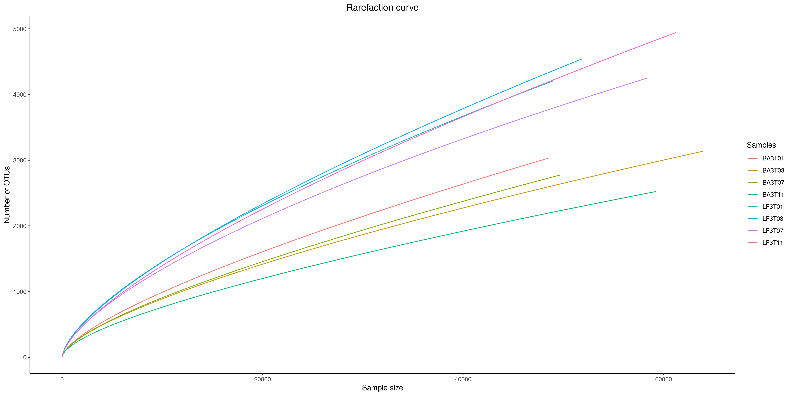

## Beta Diversity

### PCoA

Now, we want to compare the diversity between samples. This could be done using ordination analysis like a Principal coordinates analysis (PCoA), which attempts to summarise and represent dissimilarities between objects in a low-dimensional space (2D or 3D). 

To make a PCoA analysis, first, we are going to rename our original file. Later we will ordinate our file by PCoA method, and using Bray Curtis algorithm to calculate distances between each sample.  

```
Valp_scale <- Valp

#ordinate
Valp_pcoa <- ordinate(
  physeq=Valp_scale,
  method="PCoA",
  distance="bray")
```
Now we can plot this

```
#plot
plot_ordination(
  physeq=Valp_scale,
  ordination=Valp_pcoa,
  shape ="Treatment",
  color = "Time",
  title="PCoA") +
  geom_point(size=5) +
  theme(plot.title= element_text(hjust=0.5)) 

ggsave("PCoA.png", device= "png", width = 30,height = 20, units="cm")

```
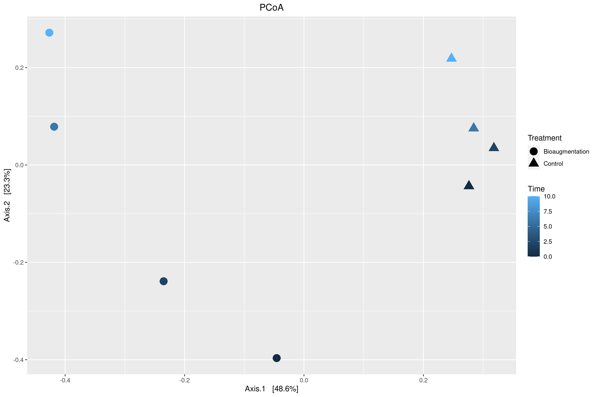

### CAP

Now we want to make a Canonical Analysis of Principal coordinates (CAP). This analysis allows to add environmenta variables into the ordination.
First, we are going to assign the Bray Curtis distance into a variable. Then, we are going to make the ordination. 

```
bray_not_na <- phyloseq::distance(physeq=Valp_scale, method="bray")

#CAP ordinate
cap_ord <- ordinate(
  physeq=Valp_scale,
  method="CAP",
  distance= bray_not_na,
  formula= ~ TPH + pH + Humidity)
```
Then, we can plot this. However, to later add some vectors with pH, Humidity and TPH information, we are going to assign a variable to the plot. 

```
#CAP plot
cap_plot <- plot_ordination(
  physeq= Valp_scale,
  ordination=cap_ord,
  color="Time",
  axes=c(1,2))+
  aes(shape=Treatment)+
  geom_point(size=5)
```

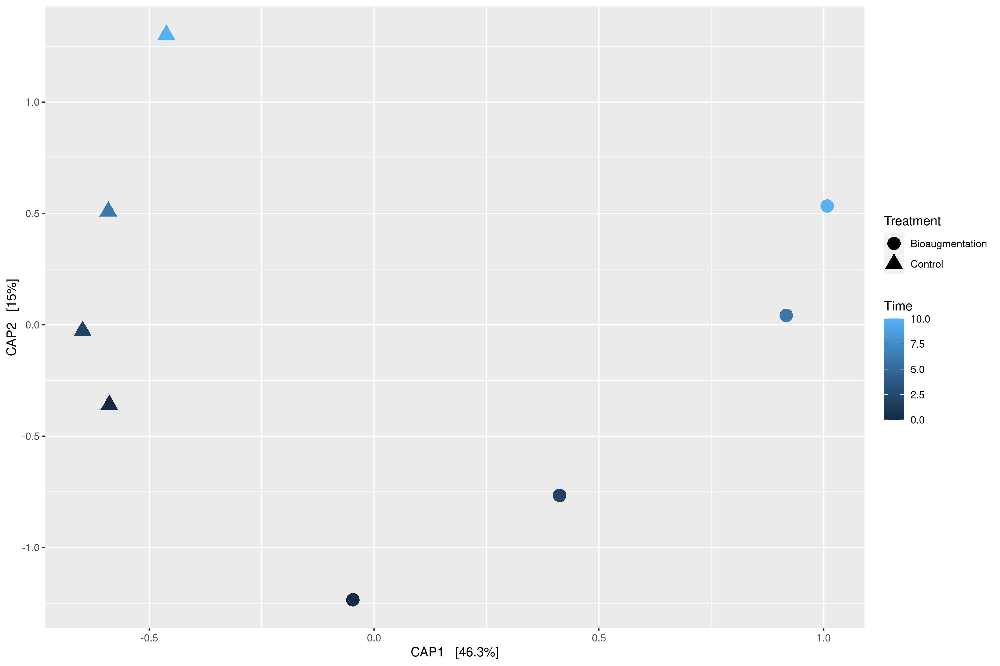

Now, we want to add the vectors as arrows to this plot. First, we are going to assign the environmental variables as arrows, and then define the arrow aesthetics.

```
#Add environmental variables as arrows
arrowmat <- vegan::scores(cap_ord, display="bp")

#Add labels, make a data frame
arrowdf <- data.frame(labels=rownames(arrowmat), arrowmat)

#Define arrow aesthetic mapping
arrow_map <- aes(xend=CAP1,
                 yend=CAP2,
                 x=0,
                 y=0,
                 shape=NULL,
                 color=NULL,
                 label=labels)
label_map <- aes(x=1.3*CAP1,
                 y=1.3*CAP2,
                 shape=NULL,
                 color=NULL,
                 label=labels)
arrowhead=arrow(length=unit(0.02,"npc"))
```
Now we can add these arrows to the plot.

```
cap_plot+
  geom_segment(
    mapping = arrow_map,
    title="CAP",
    size=.5,
    data=arrowdf,
    color="gray",
    arrow=arrowhead
  )+
  geom_text(
    mapping=label_map,
    size=4,
    data=arrowdf,
    show.legend = FALSE
  )

ggsave("CAP.png", device= "png", width = 30,height = 20, units="cm")
```
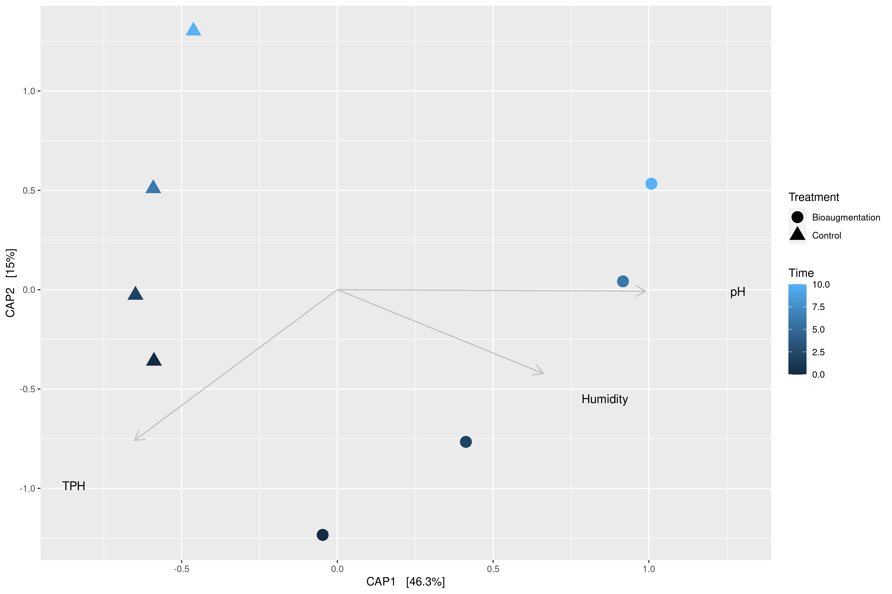

